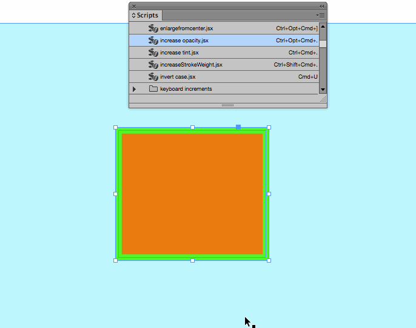
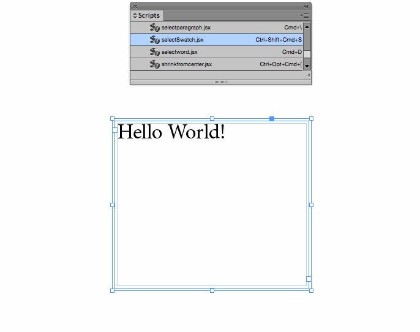
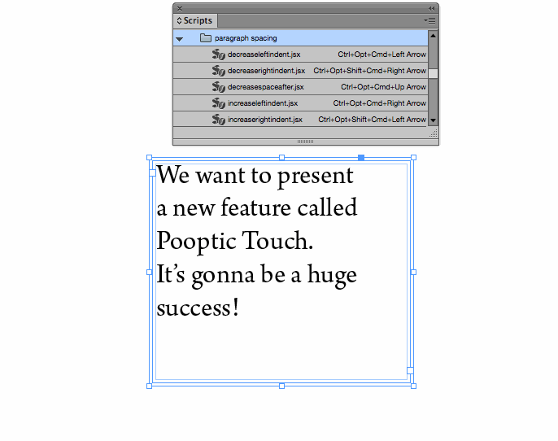
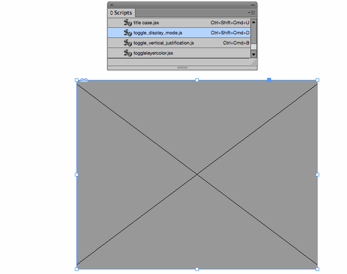
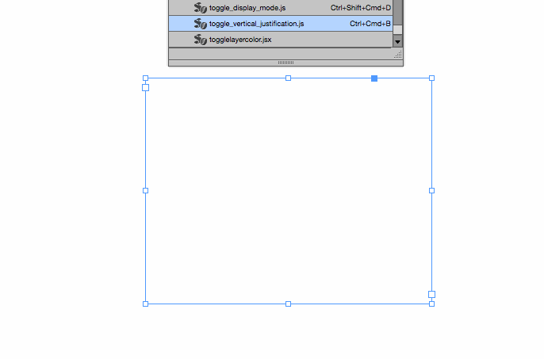

These JSX scripts for Indesign are mostly written by me with the help of guys from [Adobe Forums](http://forums.adobe.com). The main puprose they have is to alleviate working in Indesign with keyboard shortcuts by adding control from keyboard to those functions that currently don't have it. My higher idea is to bring working from keyboard in Indesign closer to the extent it's possible in Sublime Text, for example. 

These scripts include:

- resizing frames by document and baseline grid divisions;
- quickly setting keyboard increments (I use <kbd>Ctrl+Cmd+Shift+numbers</kbd> for that);
- flexibly controlling opacity, stroke weight and tint;
- starting to edit text in the currently selected frame from keyboard (<kbd>Enter</kbd>);
- invert text case or setting Title case on a word the cursor is currently inside of (<kbd>Cmd+U</kbd>, <kbd>Ctrl+Cmd+Shift+U</kbd>);
- selecting current word (<kbd>Cmd+D</kbd>);
- moving objects to another layer (<kbd>Ctrl+Alt+Cmd+Home</kbd>, <kbd>Ctrl+Alt+Cmd+End</kbd>);
- opening selection in new window — I use this as a trick for editing in one (often little) window, viewing the result without selection frames in another as it's not possible to hide frame edges for the current selection like in Sketch;
- selecting swatches from keyboard that doesn't mess with Swatches palette state;
- toggle different vertical justification modes from keyboard (<kbd>Ctrl+Cmd+B</kbd>)
- and others.

You can make use of them by putting the ones you like into Indesign's Scripts folder and them assigning to them some keyboard shortcut via `Edit->Keyboard Shortcuts`. Remember to do that, there's no way to automatically set a shortcut in Indesign upon downloading a script! 

Sometimes they don't have proper error catching and everything, so be prepared.

I hope you find it useful and offer your ideas and suggestions.

Some previews are below.

**Changing keyboard increments from keyboard:**

**Changing frame parameters such as opacity:**

**Resizing frame by document or baseline grid divisions:**

**Simply resizing frames from center:**

**Choosing swatches for current selection:**

**Starting frame editing mode from keyboard:**

**Toggling between display performance modes:**

**Toggling between vertical justification modes:**

